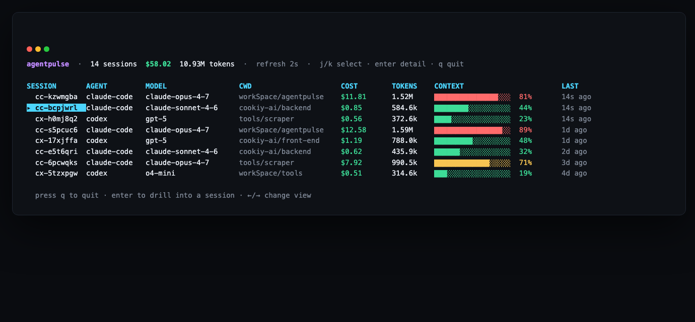
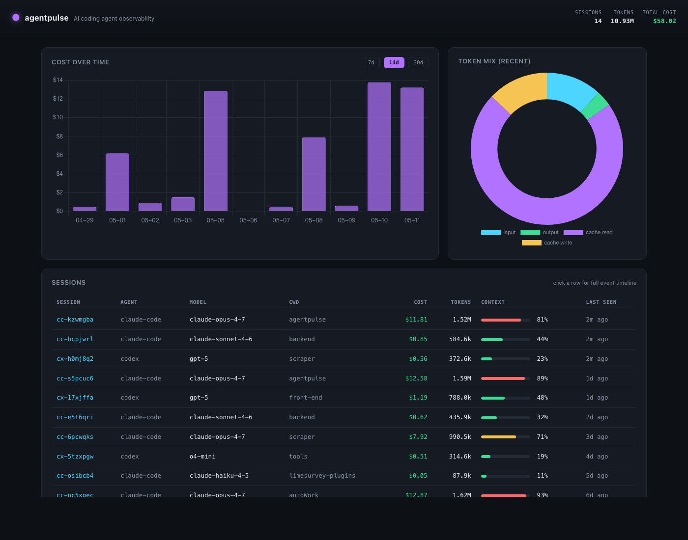
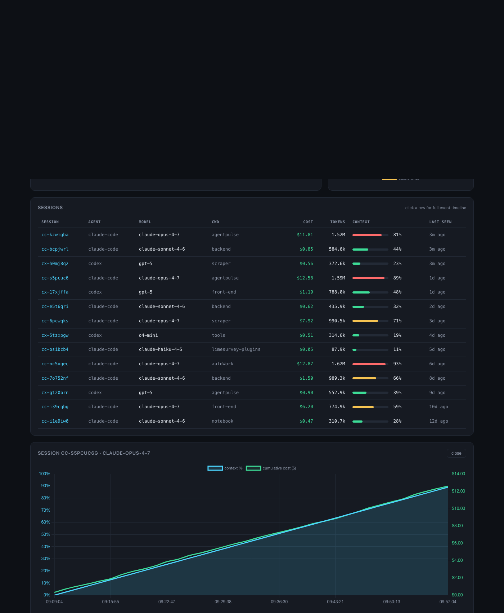

<h1 align="center">agentpulse</h1>

<p align="center"><b>htop in your terminal · Grafana in your browser · for AI coding agents.</b></p>

<p align="center">
  Token, cost, context % and rate-limit observability for Claude Code, Codex CLI and Cursor.
  <br/>
  Local-first. Zero cloud. One binary.
</p>

<p align="center">
  <!-- Replace placeholders after first publish -->
  
  
  
</p>

<p align="center">
  
</p>

<p align="center"><i>Same data, two surfaces — terminal when you don't want to leave it, browser when you want history and charts.</i></p>

<p align="center">
  
</p>

<p align="center"><i>Click any session row → drill into context burn and cumulative cost over time.</i></p>

<p align="center">
  
</p>

---

## Why

Running 2+ Claude Code / Codex sessions in parallel and the rate limit just exploded? Same here.

`abtop` and `codeburn` solved this for the terminal. **agentpulse adds the web layer:** persistent SQLite history, daily/weekly cost charts, click-into-session timelines — and a TUI when you don't want to leave the terminal.

| feature | abtop | codeburn | hermes-web-ui | **agentpulse** |
| --- | :---: | :---: | :---: | :---: |
| TUI | ✅ | ✅ | ❌ | ✅ |
| Web dashboard | ❌ | ❌ | ✅ | ✅ |
| Persistent history | ❌ | ⚠ | ✅ | ✅ |
| Single static binary | ✅ | ❌ | ❌ | ✅ |
| Local-first / zero cloud | ✅ | ✅ | ❌ | ✅ |

## Install

```bash
curl -fsSL https://raw.githubusercontent.com/yf0522/agentpulse/main/scripts/install.sh | bash
```

Or build from source:

```bash
git clone https://github.com/yf0522/agentpulse agentpulse
cd agentpulse
bun install
bun run compile          # → dist/agentpulse (single ~60MB binary)
```

## Quick start

```bash
agentpulse setup         # wire ~/.claude/settings.json statusLine hook
# (restart any running Claude Code session)
agentpulse web           # opens http://localhost:4757 in your browser
agentpulse tui           # opens the terminal dashboard
```

No data yet? Seed sample data:

```bash
agentpulse seed
```

## Commands

| command | what it does |
| --- | --- |
| `agentpulse setup` | install statusline hook into `~/.claude/settings.json` |
| `agentpulse uninstall` | remove the hook |
| `agentpulse hook` | internal · called by Claude Code each statusline tick |
| `agentpulse tui` | terminal dashboard (Ink) |
| `agentpulse web [--port=N]` | web dashboard (default `:4757`) |
| `agentpulse stats` | plain-text summary |
| `agentpulse seed` | insert sample data |
| `agentpulse codex-import [path]` | ingest Codex CLI sessions (default `~/.codex/sessions`) |
| `agentpulse codex-watch [--dir=...]` | live-watch Codex sessions directory |

## Data lives here

```
~/.agentpulse/agentpulse.db     # SQLite, WAL mode, local-only
```

Nothing leaves your machine. No telemetry. No remote calls. Open the file in any SQLite browser if you want to poke around.

## Architecture

```
Claude Code ──statusline JSON──▶ agentpulse hook ──▶ SQLite (~/.agentpulse/agentpulse.db)
                                                          │
                                          ┌───────────────┴───────────────┐
                                          ▼                               ▼
                                     TUI (Ink)                    Web (Bun + Chart.js)
```

- **Hook** — parses Claude Code's statusline JSON (model, cwd, cost, context flag) on each tick, writes one event row.
- **TUI** — polls SQLite every 2s. List view + per-session detail view with event timeline.
- **Web** — Bun's native HTTP server, JSON API, embedded HTML/JS/CSS. Auto-refresh every 4s.

## Stack

- **Bun** + **TypeScript** — single language, single static binary via `bun build --compile`
- **Ink** + React — TUI
- **bun:sqlite** — embedded zero-dependency storage
- **Chart.js** + vanilla JS — web charts (no React framework overhead)

## Codex CLI

Codex doesn't expose a statusline hook, so agentpulse ingests by reading its rollout JSONL files (default: `~/.codex/sessions/`).

```bash
agentpulse codex-import                  # one-shot ingest of ~/.codex/sessions
agentpulse codex-import /path/to/file.jsonl
agentpulse codex-watch                   # daemon: re-ingest on every change
```

Run `codex-watch` in a tmux pane (or as a launchd / systemd unit) and Codex sessions show up in the same dashboards as Claude Code.

## Roadmap

- [x] **Codex CLI** session ingest
- [ ] **Cursor** session import
- [ ] Per-project tagging and cost split
- [ ] Optional Pro: end-to-end-encrypted cross-machine sync
- [ ] Optional Team: multi-user dashboard with audit log

## License

MIT

---

<a id="cn"></a>

# 中文 · agentpulse

> AI 编程 Agent 的可观测性看板：终端里像 htop，浏览器里像 Grafana。
> 本地优先，零云端，一个二进制。

为同时跑 2+ Claude Code / Codex / Cursor 会话的人做的：**实时看 token 烧到哪、context 还剩多少、rate limit 倒计时、每天烧了多少钱。**

`abtop`、`codeburn` 解决了终端的问题，agentpulse 在它们的基础上加了**Web 可视化层**：持久化历史、日/周成本图、点进去看单 session 的完整时间线。

## 安装

```bash
curl -fsSL https://raw.githubusercontent.com/yf0522/agentpulse/main/scripts/install.sh | bash
```

源码编译：

```bash
git clone https://github.com/yf0522/agentpulse agentpulse
cd agentpulse
bun install
bun run compile          # 产出 dist/agentpulse（单文件 ~60MB）
```

## 快速开始

```bash
agentpulse setup         # 写入 ~/.claude/settings.json statusLine 钩子
# 重启正在跑的 Claude Code 会话
agentpulse web           # 浏览器打开 http://localhost:4757
agentpulse tui           # 终端面板
```

没数据时：

```bash
agentpulse seed
```

## 命令

| 命令 | 用途 |
| --- | --- |
| `agentpulse setup` | 写入 Claude Code 的 statusline 钩子 |
| `agentpulse uninstall` | 移除钩子 |
| `agentpulse hook` | 内部：每次 statusline 触发时写入数据 |
| `agentpulse tui` | 终端面板 |
| `agentpulse web [--port=N]` | Web 面板（默认 `:4757`） |
| `agentpulse stats` | 纯文本汇总 |
| `agentpulse seed` | 写入示例数据 |

## 数据位置

```
~/.agentpulse/agentpulse.db     # SQLite WAL 模式 · 仅本地
```

没有任何数据离开你的电脑。没有遥测，没有远程调用。

## License

MIT
